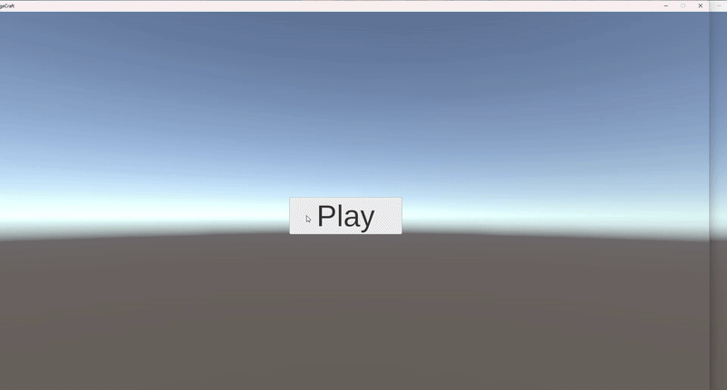
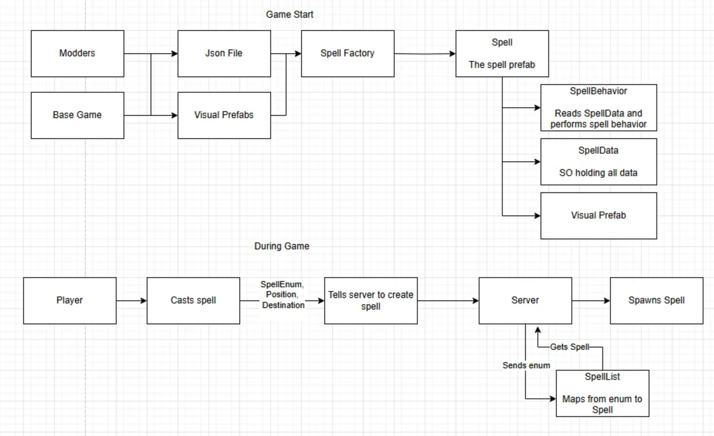

# SpellFire
My third game, creating SpellFire -- a FFA battle arena in which players knock others out of the arena. 

THIS IS A WIP AND NOT A COMPLETED GAME.

## Planned features
- Reading JSON file of spell data -> generating spells during runtime
  
  

## Instructions
- Enter your display name
- Either host the lobby or join a lobby
  - If joining a host on the same computer, *type* localhost and join
  - localhost is not typed in by default and will give you an error if you attempt to join without typing anything
- Once all players are in the lobby and readied, click start on the host's game
- Right click to move

## Installation Instructions
- Go to [https://drive.google.com/drive/folders/1USLA4XtNkmy-_OsqMOl_cn8opmX4Zq7Q?usp=sharing](https://drive.google.com/drive/u/0/folders/1V92nGs4jmWYn7r648CbAwUtMRmgJDpIM) (currently supports Windows and Mac).
- Download the appropriate zip file.
- Extract zip file.
- Run MageCraft.exe.
  - The game was originally called MageCraft. I have since renamed it to SpellFire.

## Progress
There are more details in my notion page. Read more there!

https://silk-tub-8b6.notion.site/3-24-2025-Spellfire-1c031abb6f3a804c8aeee4a8eba12c55?pvs=4

